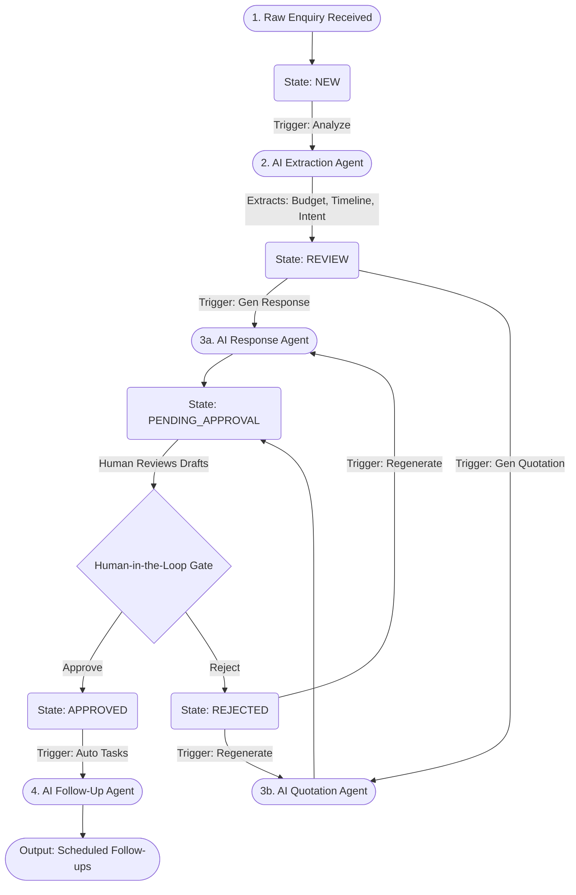
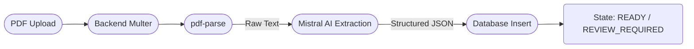

# OPSPILOT AI — Agentic Pipeline & Architecture Overview

While OPSPILOT AI does not strictly use the Python-based `langgraph` library under the hood, the core architecture is heavily inspired by **Directed Acyclic Graph (DAG) Agentic Workflows** and state-machine pipelines. 

This document outlines the pipeline architecture, how AI tasks are sequenced, and how the "Human-in-the-Loop" (HITL) gate functions within the platform.

---

## 🏗️ System Architecture

OPSPILOT relies on a **Node.js (TypeScript) + Express** backend, which orchestrates the AI pipelines by combining standard relational states (PostgreSQL/Supabase) with LLM inference (Mistral AI).

### Core Components
1. **Frontend (React):** Acts as the dashboard and command center. It visualizes the current pipeline state of an Enquiry (e.g., `NEW` → `ANALYZING` → `REVIEW` → `PENDING_APPROVAL` → `APPROVED`).
2. **Controller/Service Layer:** Orchestrates the graph logic. It ensures an enquiry cannot jump from `NEW` directly to `APPROVED` without passing through the AI generation and Human Approval nodes.
3. **AI Provider (Mistral):** Acts as the cognitive engine. It parses unstructured text, extracts structured JSON, and generates business artifacts (drafts, quotes, follow-ups).
4. **Database State Store (Supabase):** Acts as the persistent memory of the graph. Every node transition (e.g., AI analysis completion) updates the state of the database to persist the workflow.

---

## 🔄 The Enquiry Processing Pipeline (The Graph)

The core feature of OPSPILOT is transforming a raw customer enquiry into an actionable business quotation. This workflow operates as a state-machine graph.

### Visual Workflow Diagram

---

## 🤖 Pipeline Nodes (AI Agents)

Each step in the pipeline behaves like an autonomous agent with a specific system prompt, inputs, and strict structured JSON outputs.

### Node 1: The Extraction Agent (`analyzeEnquiry`)
* **Input:** Raw, unstructured customer text/email.
* **Prompt Engineering:** Instructed to act as an Indian small-business CRM analyst.
* **Output (JSON):** 
  * Extracted entities: `customerName`, `budget`, `timeline`.
  * Classification: `priority` (LOW, MEDIUM, HIGH).
  * Contextual analysis: `missingQuestions`, `summary`.
* **State Transition:** Moves the entity from `NEW` to `REVIEW`.

### Node 2: The Quotation Agent (`generateQuotation`)
* **Input:** The structured JSON output from Node 1 (Context).
* **Prompt Engineering:** Instructed to act as a senior business consultant creating realistic Indian market pricing.
* **Output (JSON):** 
  * A fully itemized breakdown: `items[]` (Description, Qty, Unit Price).
  * Financials: `subtotal`, `tax` (e.g., 18% GST), `total`.
  * Context: `notes`, `validityDays`.
* **State Transition:** Generates a relational `quotations` record and moves the entity to `PENDING_APPROVAL`.

### Node 3: The Communication Agent (`generateResponse`)
* **Input:** The structured JSON output from Node 1.
* **Prompt Engineering:** Instructed to draft polite, professional emails without making unauthorized pricing commitments.
* **Output (JSON):** A drafted email text.
* **State Transition:** Updates the entity and moves to `PENDING_APPROVAL`.

### Node 4: The Task Scheduling Agent (`generateFollowUps`)
* **Input:** The approved enquiry state and priority level.
* **Prompt Engineering:** Instructed to generate 3-5 actionable tasks based on urgency. (e.g., HIGH priority = task due in 1 day).
* **Output (JSON):** Array of tasks (`title`, `description`, `daysFromNow`).
* **State Transition:** Creates relational `follow_ups` records for the sales team.

---

## 🛡️ Human-in-the-Loop (HITL) Architecture

OPSPILOT AI strictly adheres to a **Human-in-the-Loop** philosophy. The AI operates autonomously to do the heavy lifting (data entry, drafting, calculations), but it lacks the authority to finalize or send data externally.

1. **The `approvals` Table:** Whenever an AI agent generates a customer-facing artifact (Quotation or Email Response), the backend automatically generates a row in the `approvals` table.
2. **The Gate:** The frontend reads this `PENDING` approval state. The user must manually review the AI's output and explicitly click **Approve** or **Reject**.
3. **Rejection Feedback Loop:** If rejected, the user can provide comments, and the pipeline loops back to the generation nodes, allowing the AI to try again.

---

## 📄 External Ingestion Pipeline (PDF Extraction)

Separate from the Enquiry pipeline, OPSPILOT handles external inbound data (e.g., Vendor Quotations received as PDFs).

This pipeline specifically targets turning opaque, unstructured third-party documents into structured internal data, highlighting the platform's role as a unified data funnel.
